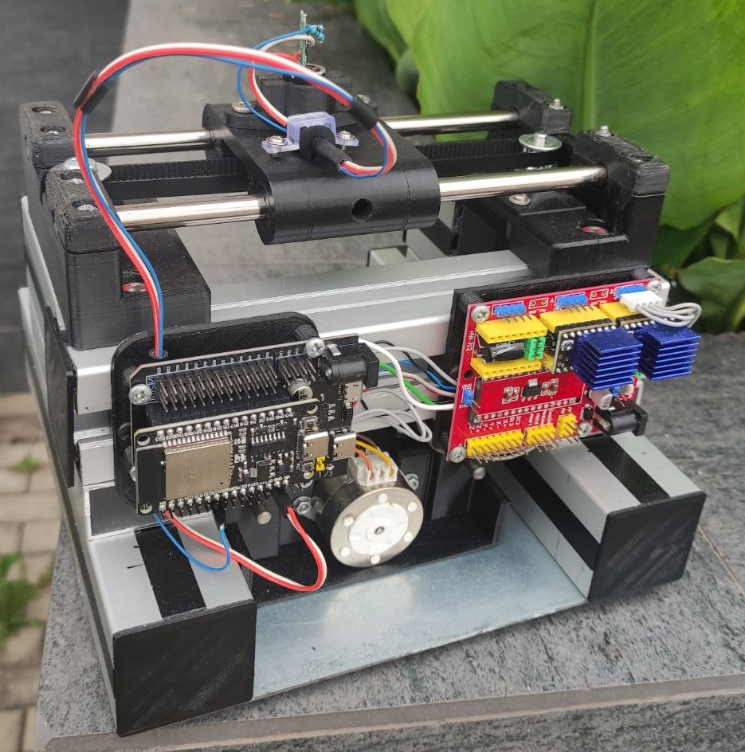

# OLTA PCB CNC Laser

 

 

Проект можно описать следующей структурой:
1. Кинематика  
   -- Станина  
   -- Верхняя ось (X)  
   -- Нижняя ось (Y)  
2. Электроника  
   -- Модуль контроллера ESP32  
   -- Шильд модуля контроллера  
   -- CNC Shield V4  
   -- Два драйвера шаговых двигателей  
5. Софт  
   -- Прошивка FluidNC (Hardware)  
   -- Конфигурационный файл FluidNC (Hardware)  
   -- Сендер (Software)  
   -- CAM  (Software)
7. Лазерный модуль

Характеристики:
- Габариты (Г/Ш/В)) - 200/200/200 мм.
- Рабочее поле - 50/100 мм (Потенциально можно увеличить до 100/100 мм, заменив нижнюю ось)
- Ускорение по X - 1000 мм в минуту за секунду
